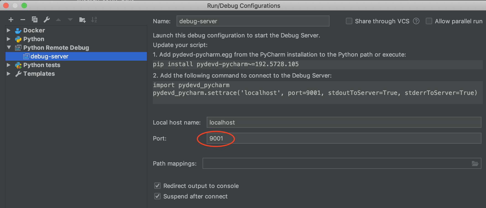

# Payment services mono repo

This repo contains micros services including:

- Payout service (WIP)
- Payin service (WIP)
- Ledger service (WIP)
- Webhook service (WIP)

# Table of contents

- [Architecture and Tech Stack](#architecture-and-tech-stack)
- [K8S access control](#k8s-access-control)
- [Deployment](#deployment)
- [Monitoring](#monitoring)
- [Infrastructure](#infrastructure)
- [Development](#development)
  - [Environment Setup](#environment-setup)
  - [Development Guide](#development-guide)
    - [Running server locally](#running-server-locally)
    - [Running server with docker](#running-server-in-docker-compose)
  - [Update Dependencies](#update-dependencies)
  - [Work with secret](#work-with-secret)
  - [Live debugging](#live-debugging)
  - [Make commands reference](#make-commands-reference)

# Architecture and Tech Stack

The `payment-service` is a Kubernetes pod with two containers:

- The `web` container running gunicorn-uviron-fastapi asyncio web service where
    - `fastapi` running asyncio supported web application
    - `uvicorn` running on top of `fastapi` web app as an ASGI web server and providing event loop implementation
    - `gunicorn` running as process manager spawning up multiple uvicorn workers for parallelism
- The `runtime` sidecar, used for configuration management

The following technologies/frameworks are used across the entire stack:

- **helm** for deployments and rollbacks
- **docker** as container engine
- **kubernetes** as container orchestrator
- **python3.7** for application code
- **fastapi** as web framework for building asyncio web service
- **uvicorn** as ASGI web server / interface for contained fastapi service
- **gunicorn** as process manager of uvicorn worker
- **pipenv** for dependency management and [deterministic builds](https://realpython.com/pipenv-guide/)
- **pytest** for unit testing
- **mypy** for static type checking
- **flake8** for linting
- **black** for code formatting
- **pre-commit** for pre-commit hooks
- **DoorDash doorctl** for images tagging/pushing
- **DoorDash Pulse** for semantic monitoring and system testing
- **DoorDash Pressure** for load testing
- **DoorDash Runtime** for configuration management
- **Artifactory** to store docker images
- **Jenkins/Groovy** for CICD

# Monitoring
- [OnCall Playbook](https://doordash.atlassian.net/wiki/spaces/PAY/pages/1026131698/Playbook+Payment+Service)
- [Wavefront Dashboards](https://metrics.wavefront.com/u/NFqvPJ66SJ)
- [Sentry Issues](https://sentry.io/organizations/doordash/issues/?project=1381528)
- [New Relic](https://rpm.newrelic.com/accounts/833981/applications/416583243)

# Infrastructure
- [README-infra.md](README-infra.md)

# K8S access control
Only authorized personnel can access payment-service k8s deployment (i.e. execute kubectl command)
## Staging
In order to access staging payment-service deployment, you need to request permission in [payments-team@](https://groups.google.com/a/doordash.com/forum/#!forum/payments-team) google group
## Prod
1. Differently than staging, you need to be in [this list](https://github.com/doordash/engineering-keys/blob/master/groups/payments.sh)
2. After you are authorized in step 1:
    ```shell script
   $ ssh <YOUR USERNAME>@bastion.doordash.com
   $ kubeswitch payments # switch kube context to payment-service namespace
    ```
# Deployment

Payment-service uses [ddops](https://github.com/doordash/infrastructure/wiki/ddops) to control releases and k8s deployment:

- [Promote pipeline](https://deployjenkins.doordash.com/job/payment-service/job/Jenkinsfile-promote.groovy/)
- [Release build pipeline](https://deployjenkins.doordash.com/job/payment-service/job/Jenkinsfile-build.groovy/)
- [CI pipeline](https://generaljenkins.doordash.com/job/payment-service/job/Jenkinsfile-nodeploy.groovy/)
- [Migration pipeline](https://deployjenkins.doordash.com/job/payment-service/job/Jenkinsfile-migrate.groovy/)
- [Dev CD pipeline](Jenkinsfile-deploy.groovy) (Always deploy merged code to staging only)

## Regular code contribution
- All PRs running through CI steps defined in [CI pipeline](https://generaljenkins.doordash.com/job/payment-service/job/Jenkinsfile-nodeploy.groovy/)
- Approved PRs are merged to master branch, **without** being deployed to k8s cluster.

## Deployment
- Payment-service [deploy pilots](https://github.com/doordash/runtime/blob/master/data/ops/authorizedDeployPersonnel.yml#L78) are authorized to perform regular deployment, hotfix, rollback or migration by [ddops commands](https://github.com/doordash/infrastructure/wiki/ddops) through deployment [slack channel](https://doordash.slack.com/messages/CL52A5SKZ)
- Deployment procedures
  - Regular deployment:
    1. `/ddops cut-release payment-service` -> output: `releaseTag`
    2. `/ddops build payment-service <releaseTag>`
    3. `/ddops migrate payment-service <releaseTag>`
    4. `/ddops promote payment-service <releaseTag>`
  - Hotfix:
    1. `/ddops add-to-release-branch payment-service <hotfix-sha> payment-service <deployed-release-branch> <hotfix-reason>` -> output: `releaseTag` ([example](https://doordash.slack.com/archives/CL52A5SKZ/p1566873325021800))
    2. `/ddops hotfix payment-service <releaseTag>` ([example](https://doordash.slack.com/archives/CL52A5SKZ/p1566862402011100))
  - Rollback:
    1. `/ddops rollback payment-service <rollback-to-release-tag> <rollback reason>` ([example](https://doordash.slack.com/archives/CL52A5SKZ/p1566862671012400))
  - Migration:
    1. `/ddops migrate payment-service <releaseTag>` ([example](https://doordash.slack.com/archives/CL52A5SKZ/p1567711383003500))
# Development

## Environment Setup

### Repository credentials

1. Make sure you have followed [New eng setup guide](https://github.com/doordash/doordash-eng-wiki/blob/master/docs/New-Engineer-Setup-Guide.md#25-configure-doorstep-django) to properly setup your PIP install indices by envionment variables `ARTIFACTORY_URL`,`ARTIFACTORY_USERNAME`,`ARTIFACTORY_PASSWORD` and `PIP_EXTRA_INDEX_URL`
2. After step #1, also include `FURY_TOKEN` in your `~/.bash_profile` by running:
   ```bash
   echo "export FURY_TOKEN=$(echo $PIP_EXTRA_INDEX_URL | sed -E -e 's/.*\/([^/]+):@repo.fury.io\/doordash.*/\1/')" >> ~/.bash_profile
   source ~/.bash_profile
   ```

### Python environment

1. Install python specified in `Pipfile.lock` (v3.7) through [pyenv](https://github.com/pyenv/pyenv) and [pipenv](https://github.com/pypa/pipenv) into a newly created python virtual environment.

   ```bash
   brew install pyenv pipenv
   brew upgrade pyenv pipenv
   # install all dependencies needed for development, including the ones installed with the --dev argument.
   make sync-pipenv
   ```

2. After step #1, a python virtual envionment should be created.

   1. To find where does environment locate, run `$ pipenv --venv`
   2. To start a sub-shell within create python virtual environment, run:
      ```bash
      pipenv shell
      # Try `pipenv shell --fancy` if you want to preserve your customized shell configuration from ~/.bashrc
      ```
   3. To go back to your original shell and deactivate python virtual env, simply run `$ exit`

3. To test if everything works, you can try:
   1. Activate python virtual env: `$ pipenv shell`
   2. running unit tests, linter and mypy: `$ make test`

### Pre-commit hook

1. Install `pre-commit` and initialize the pre-commit hooks; these will run before every commit

   ```bash
   brew install pre-commit
   pre-commit install
   ```

2. Run Pre-Commit Hooks

   If you want to manually run all pre-commit hooks on a repository, run `pre-commit run --all-files`. To run individual hooks use `pre-commit run <hook_id>`.

   Pre-commit `<hook_id>` are defined in `.pre-commit-config.yaml`. Example commands:

   ```bash
   pre-commit run --all-files
   pre-commit run black --all-files
   ```

## Development guide

### Running server locally

```bash
pipenv shell
make local-server
```

- Local service will be running in development and debug mode.
  Any code changes will lead to a service reload and therefore be reflected in real-time.
- Confirming local server is up running:
  ```bash
  curl localhost:8000/health # port is defined in Makefile::local-server
  ```

#### Running tests in local environment

1. Activate python virtual env: `$ pipenv shell`
2. Available test targets:
   ```bash
   make test # runs unit tests, linter, mypy (not pre-commit hooks)
   make test-unit # runs unit tests only
   make test-typing # runs mypy only
   make test-lint # runs linter only
   make test-hooks # runs pre-commit hooks only
   ```

### Running server in docker-compose

```bash
make start-local-docker-server
```

- Similarly as `local-server`, ./app directory is binded as a volume under web docker container.
  Therefore live reload is also available here.
- Confirming server is up running in docker:
  ```bash
  curl localhost:8001/health # docker port mapping defined in docker-compose.yml web container
  ```

### Testing

#### Run all tests
Refers to [run tests locally](#running-tests-in-local-environment)


#### Write tests
We categorize tests cases into 3 groups with in payment-service repo. (Pulse test will be covered separately).

1. **Unit tests**: Test cases should focus on test unit functionality **without any real connections to remote dependencies** like database, redis or stripe. Any remote dependencies should be mocked out in unit test case.
    - Make target: `make test-unit`
    - Directory: within each top level components (e.g. commons, payin, payout, ledger, middleware...), there is a `test_unit` folder where orresponding unit test files should be created.


2. **Integration tests**: Test cases should focus on validate integration contract and santity with remote dependencies. Alternatively, if you really have to wire up dependency components to test some integration behavior, you can create test cases as integration test.
    - Make target:
        - `make test-integration`: run all integration tests including test cases depending on remote dependencies we owned (e.g. DB) and external dependencies like stripe.
        - `make test-external`: only run test cases marked with `pytest.mark.external`, which usually are tests depending on external dependencies like stripe.
    - Directory: within each top level components (e.g. commons, payin, payout, ledger, middleware...), there is a `test_integration` folder where orresponding integration test files should be created.
    - Note: **DO NOT** place integrate tests outside of a `test_integration` folder, otherwise our test scripts won't startup corresponding dependencies for the test.


### Update Dependencies

The `payment-service` uses `pipenv` to ensure deterministic builds.
To add or update a dependency, you can do the following:

1. Add or update dependency in `Pipefile` via your text editor
2. Run following command to update `Pipefile.lock` and install from updated lock file
   ```bash
   make update-pipenv
   ```
3. After you are done, remember to open a PR to checkin the changes!

### Work with secret

Payment-service integrated with [Ninox](https://github.com/doordash/ninox/tree/master/ninox)
as source of all secret configurations, such as DB credentials and Stripe private keys.

#### Setup Ninox access locally

1. Make sure you are in google group [eng-payment@](https://groups.google.com/a/doordash.com/forum/?hl=en#!forum/eng-payment),
   otherwise please ask one of payment team member to add you in.
2. Fetch `okta-prod-payment-eng-user` Okta-aws profile via:
   ```bash
   okta-aws init
   ```
   In case, you don't have `okta-aws` cli installed, follow [here](https://github.com/doordash/doordash-eng-wiki/blob/master/docs/New-Engineer-Setup-Guide.md#21-install-aws-cli)
3. Verify you have successfully fetched aws profile by:
   ```bash
   grep okta-prod-payment-eng-user ~/.aws/credentials
   # Expected output>> [okta-prod-payment-eng-user]
   ```
4. Install Ninox:
   ```bash
   brew install Ninox
   ```
   If fails, ensure you have tapped into [doordash homebrew taps](https://github.com/doordash/homebrew-tap#setup)
5. Verify Ninox user role working:
   ```bash
   cd YOUR_PAYMENT_SERVICE_REPO
   ninox -s staging_user config
   ```
   You should see output similar to following without errors:
   ```bash
   Loading team staging_user
   {'backend': 'dbd',
    'ignore_entropy_check': False,
    'kms_key_alias': 'alias/ninox/payment-service',
    'prefix': '/ninox/payment-service/',
    'profile': 'okta-prod-payment-eng-user',
    'region': 'us-west-2',
    'role': 'arn:aws:iam::016116557778:role/ninox_payment-service_xacct_user_staging',
    'session': Session(region_name='us-west-2'),
    'table': 'ninox-payment-service-staging'}
   ```
6. Ninox secret create, update, retrieve from cli

   1. As a payment engineer, I want to create or update secret

      ```bash
      cd PAYMENT_REPO
      ninox -s [staging_user | prod_user] [create | update] <secret_name_all_lower_case>
      ```

      Note: as of 07/25/2019 Ninox cli hasn't support `ls` for user role yet.

   2. As a payment engineer, I want to see if the secret is created / updated as expected.

      **Really not a good practice!!**, but if you really want you need to login to one of the staging or prod payment-service-web pod and do:

      ```bash
      ninox -s [staging | prod] get <secret_name_all_lower_case>
      ```

      Note: Once we have a better way to validate, will update.

### Live debugging

#### Pycharm

1. Setup your pycharm remote debugger by `Run` -> `Edit Configurations` -> `+` -> `Python Remote Debug`
2. Name it as `debug-server` and listen to **localhost:9001** as following:
   
3. Start up your debugger from menu as `Run` -> `Debug...` -> `debug-server`
4. Same remote debugger can be used to live debug one of local server and test
   1. For local-server: `make local-server DEBUGGER=enabled`
   2. For tests: `make test-unit DEBUGGER=enabled`

## Make commands reference

Here's a reference to all available `make` commands:

```bash
make docker-build # use docker to build the service image

make build-ci-container # build the docker container for CI, using docker-compose.ci.yml

make run-ci-container # start the docker container for CI in daemon mode

make local-server # run service on your local host within python virtual env

make local-docker-server # run service with docker-compose

make test # runs unit tests, linter, mypy (not pre-commit hooks)

make test-unit # runs unit tests only

make test-integration # runs integration tests (incl. database tests) only

make test-external # runs external tests only (ie. that talk to an external dependency)

make test-typing # runs mypy only

make test-lint # runs linter only

make test-install-hooks # installs pre-commit hooks

make test-hooks # runs pre-commit hooks only
